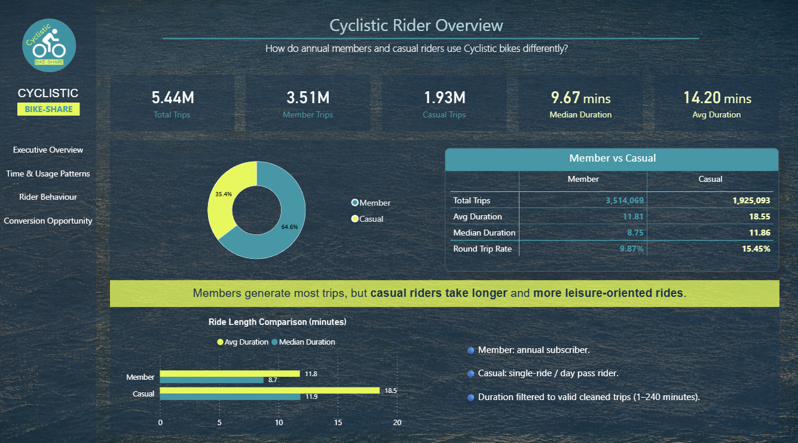
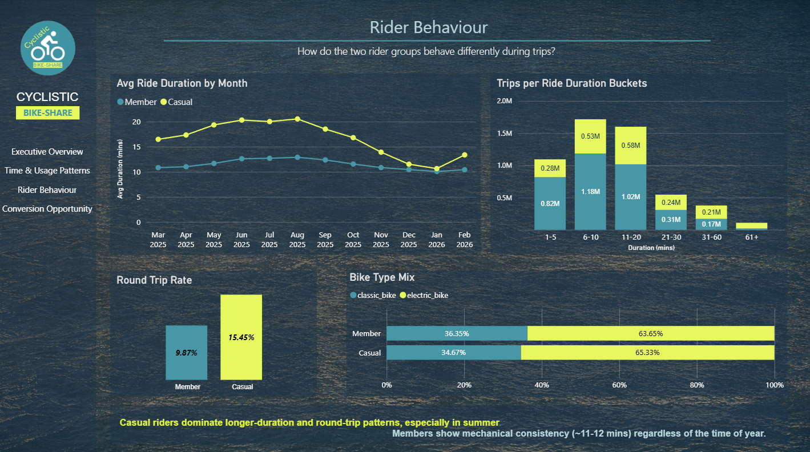
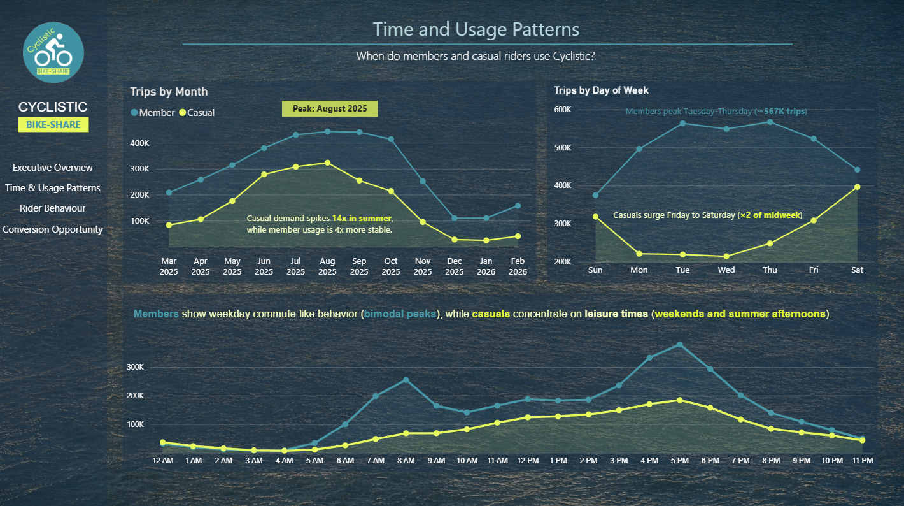
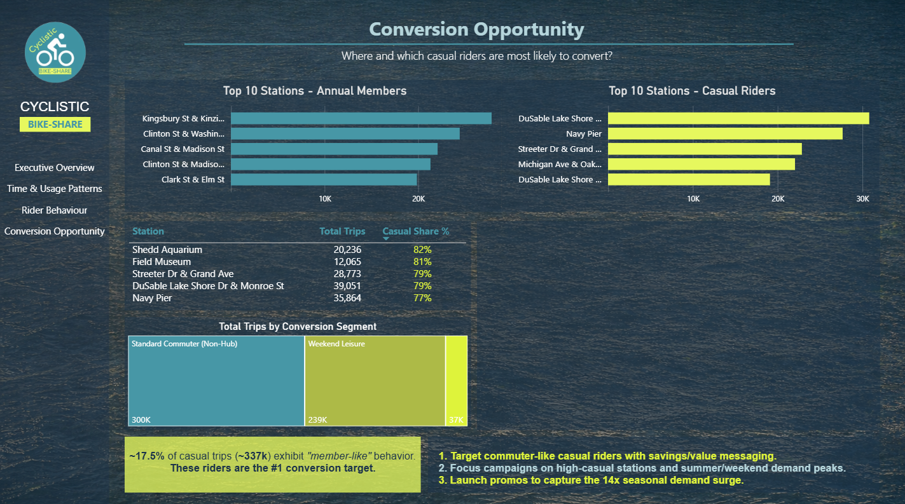

# Cyclistic Bike-Share Case Study

	

## Project Overview

This repository contains an end-to-end data analytics case study based on Cyclistic bike-share trip data.
The goal is to compare casual riders and annual members, then identify behavior patterns that can guide conversion-focused marketing decisions.
This project was completed as the capstone project for the Google Data Analytics Certificate.

The workflow follows a full analytics pipeline:

1. Data cleaning and preparation
2. Data quality auditing and validation
3. Exploratory and comparative analysis
4. Visualization and communication of recommendations

## Business Task

Analyze how casual riders and annual members use Cyclistic bikes differently, and surface insights that can help convert casual riders into annual members.

## Dataset Summary

- Source files: monthly Divvy/Cyclistic trip exports
- Analysis window: 2025-03 to 2026-02
- Total rows analyzed: 5,439,162
- Total columns: 28

Headline rider metrics:

- Member trips: 3,514,069
- Casual trips: 1,925,093
- Member average ride length: 11.81 minutes
- Casual average ride length: 18.55 minutes
- Member median ride length: 8.75 minutes
- Casual median ride length: 11.86 minutes

## Screenshots

### Executive Overview

### Rider Behavior

### Time Usage

### Conversion Opportunity

## Repository Structure

- `01_Raw_Data/` - Raw monthly trip files (local only, excluded from Git by `.gitignore`)
- `02_Processed_Data/` - Cleaned datasets, validation reports, and analysis-ready tables
- `02_Processed_Data/analysis_outputs/` - Aggregated CSV outputs used for charts and insights
- `03_Scripts/` - Jupyter notebooks for processing and analysis
- `04_Visualizations/` - Exported figures and visual artifacts
- `05_Docs/` - Supporting project documentation

## Key Artifacts

- Cleaning and processing notebook: `03_Scripts/01_data_cleaning_and_processing.ipynb`
- Analysis notebook: `03_Scripts/02_analyze.ipynb`
- KPI snapshot: `02_Processed_Data/analysis_outputs/headline_metrics.json`
- Chart exports: `04_Visualizations/analysis_exports/`

## Tools Used

- Python (Pandas, NumPy)
- Jupyter Notebook
- Data visualization libraries (Matplotlib/Seaborn)
- CSV-based reporting outputs

## How To Reproduce

1. Clone this repository.
2. Create and activate a Python virtual environment.
3. Install dependencies used in the notebooks (for example: pandas, numpy, matplotlib, seaborn, jupyter).
4. Place the monthly raw CSV files in `01_Raw_Data/`.
5. Run notebooks in order:
	- `03_Scripts/01_data_cleaning_and_processing.ipynb`
	- `03_Scripts/02_analyze.ipynb`
6. Review outputs in:
	- `02_Processed_Data/analysis_outputs/`
	- `04_Visualizations/analysis_exports/`

## Notes

- Large raw data exports are intentionally excluded via `.gitignore`.
- Core analysis outputs and visualizations are kept so reviewers can validate results quickly.
- Data download source (official): https://divvy-tripdata.s3.amazonaws.com/index.html

<!-- Trigger Change -->
